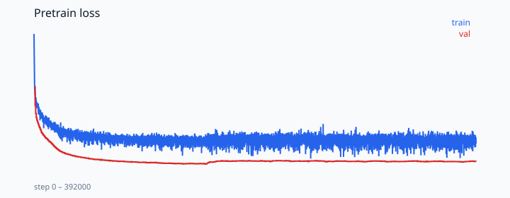
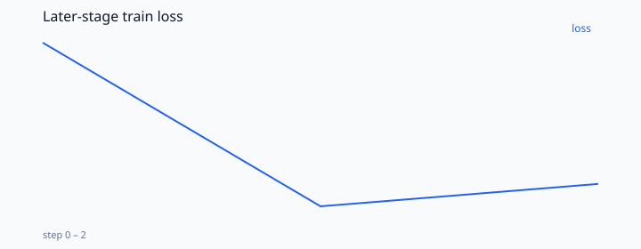

# KataAgent

From-scratch 23M language model trained into a Python kata agent: write → test → fix.

**29/30** hand katas · **35/40** frozen synth · gold tools **30/30**

```bash
python -m agent.cli eval --policy model --split hand \
  --ckpt artifacts/checkpoints/sft/best.pt \
  --tokenizer artifacts/tokenizer/tokenizer.json
```

## Method
- Own 32k BPE + KataLM from random init (23.13M, `384d / 6L / 6H`, tied embeddings)
- Pretrain on FineWeb-Edu, CodeSearchNet Python, and katas (175M tokens)
- Mid-train on code and tool traces, then SFT
- Tools: `read_task`, `write_solution`, `run_tests`, `finish`
- CUDA only (RTX 4060)

## Results

Pretrain val **2.71** after 392k steps.





| Policy | Hand (30) | Frozen synth (40) |
|--------|-----------|-------------------|
| Gold | 30/30 | — |
| SFT | 29/30 | 35/40 |

## Run
```bash
pip install -e ".[dev]"
pytest -q
python -m agent.cli eval --policy gold --split hand
```

Weights live in `artifacts/checkpoints/` (not in git). Tokenizer and figures are in the repo.

## Links
- [PLAN.md](./PLAN.md)
- [docs/results.md](./docs/results.md)
