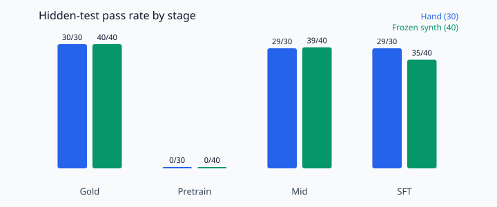

# Results

KataLM 23.13M (`384d / 6L / 6H`, 32k tied BPE) trained from scratch on an RTX 4060, CUDA only.

**Gold** is a scripted solver that already knows the answer (it checks the tests). **Pretrain** is the language model. **Agent** is that model after fine-tuning on code and tool traces (not RL).

## Data

| Split | Tokens |
|-------|--------|
| Pretrain | 175,020,979 |
| Val | 5,413,020 |
| Mix | FineWeb-Edu, CodeSearchNet Python, synth/hand katas |

## Training

| Stage | Steps | Val / notes |
|-------|-------|-------------|
| Pretrain | 392,015 | best val 2.71 |
| Agent | 20,000 | code + tool traces |

## Eval

Hand (30) = written katas. Frozen synth (40) = held-out generated katas. Pass = hidden tests succeed.

| Stage | Hand (30) | Frozen synth (40) |
|-------|-----------|-------------------|
| Gold | 30/30 | 40/40 |
| Pretrain | 0/30 | 0/40 |
| Agent | 29/30 | 39/40 |



```bash
python -m agent.cli eval --policy model --split hand \
  --ckpt artifacts/checkpoints/mid/best.pt \
  --tokenizer artifacts/tokenizer/tokenizer.json
```
